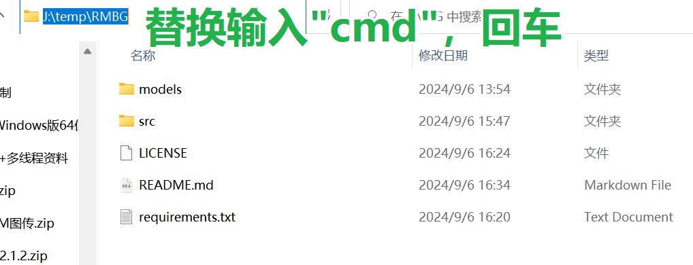

# RMBG

> Remove-background

抠图，除了抠图还是抠图

remove-bg 网站开始收费，一大堆牛鬼神蛇也开始收费了-_-

## 安装指南

1. Ensure you have Python 3.7 or higher installed on your system.

2. Clone this repository:

   - 请直接下载或者git clone的方式下载源文件

3. 安装所需依赖：

   for 全球用户：
   ```
   pip install -r requirements.txt
   ```

   for 中国大陆用户（使用阿里云镜像）：
   ```
   pip install -r requirements.txt -i https://mirrors.aliyun.com/pypi/simple/
   ```

   或者使用清华大学镜像：
   ```
   pip install -r requirements.txt -i https://pypi.tuna.tsinghua.edu.cn/simple
   ```


## 跑起来

1. 打开命令行窗口：
   

2. After completing the setup, you can run the application using：

```python
python src/main.py
```


## Usage使用指南


1. Click "Select Input Images" to choose the images you want to process.
2. Click "Select Output Folder" to choose where the processed images will be saved.
3. Click "Process Images" to remove the backgrounds from the selected images.

You can also drag and drop images directly into the application window.


# 效果对比

三张示例图，效果应该能有85分吧 :)


## License开源协议

[MIT License](LICENSE)
