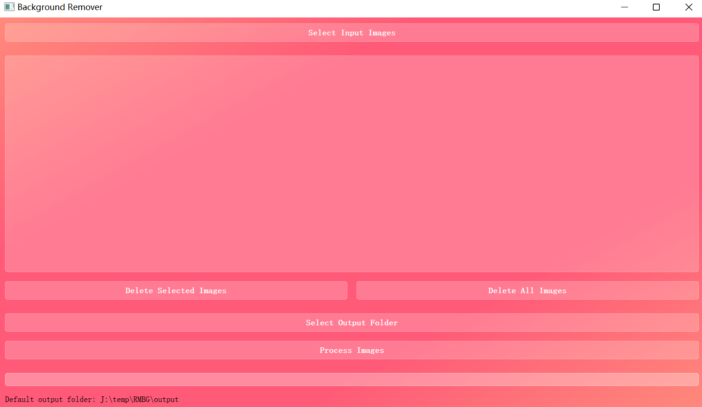
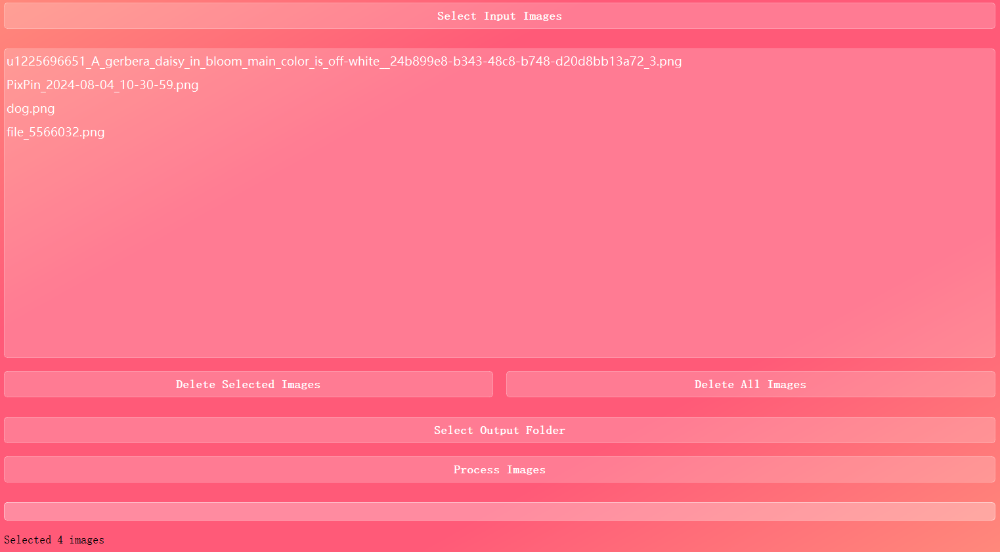
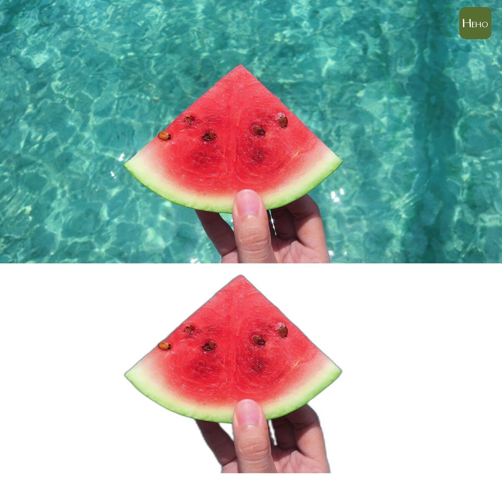
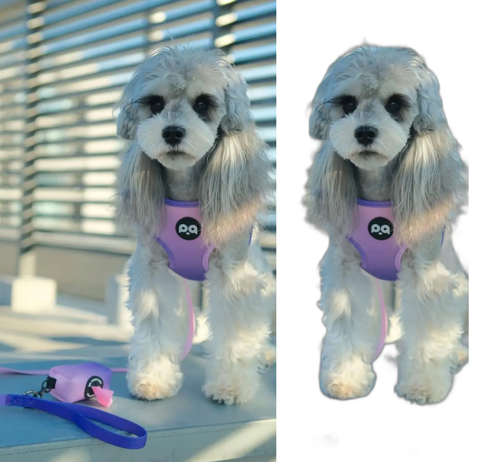
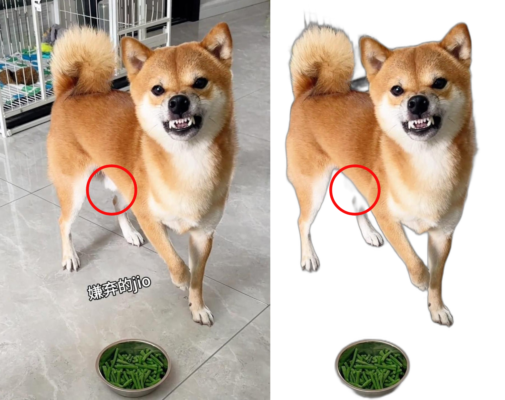

# RMBG: 抠图工具使用指南

**RMBG** 是一个基于 [RMBG-1.4](https://huggingface.co/briaai/RMBG-1.4) 开发的抠图工具。随着一些在线抠图服务如 remove-bg 开始收费，RMBG 为用户提供了一个免费、高效的本地解决方案。无论你是设计师、摄影师还是普通用户，RMBG 都可以帮助你轻松去除图片背景。

## 技术细节

### 项目结构

RMBG 项目结构简单明了，主要包含以下几个部分：

- **src/**: 存放核心代码文件，包括主程序 `main.py` 和其他辅助模块
- **models/**: 存放预训练模型文件，如 `u2net.onnx`
- **resources/**: 存放项目所需的资源文件，如图片和图标
- **requirements.txt**: 列出了项目依赖的 Python 包

### 核心技术

RMBG 使用了 U-Net 架构的深度学习模型 `u2net.onnx`，该模型在图像分割任务中表现出色。通过加载预训练的模型，RMBG 能够快速准确地去除图片背景。

## 安装指南

### 系统要求

Ensure you have Python 3.7 or higher installed on your system.

### 下载源文件

- 请直接下载或者git clone的方式下载源文件

### 安装依赖

1. **全球用户**：

```bash
pip install -r requirements.txt
```

2. **中国大陆用户**（使用阿里云镜像）：

```bash
pip install -r requirements.txt -i https://mirrors.aliyun.com/pypi/simple/
```

或者使用清华大学镜像：

```bash
pip install -r requirements.txt -i https://pypi.tuna.tsinghua.edu.cn/simple
```

### 下载模型

1. **从网盘下载**：
    - 如果是从网盘下载的用户，这步可略过
2. **从 GitHub 下载**：
    - 直接跑一遍程序，可以在命令行窗口看到 u2net.onnx 被下载到了何处，直接剪切到项目文件夹 'models'内
    - 或者从网盘下载
    - 或者去 huggingFace 下载 u2net.onnx

## 运行指南

### 启动程序

1. 打开命令行窗口，导航到项目根目录。
2. 运行以下命令启动程序：

```bash
python src/main.py
```

### 使用指南

    

    

1. **选择输入图片**：
    - 点击 "Select Input Images" 按钮，选择你想要处理的图片。
    - 你也可以直接将图片拖拽到应用程序窗口中。

2. **选择输出文件夹**：
    - 点击 "Select Output Folder" 按钮，选择处理后的图片保存位置。

3. **处理图片**：
    - 点击 "Process Images" 按钮，程序将自动去除图片背景并保存到指定文件夹。

### 效果对比

- 三张示例图，效果应该能有85分吧 :)







## 讨论和未来展望

### 当前技术趋势

随着深度学习技术的快速发展，图像处理领域也在不断进步。U-Net 架构因其在图像分割任务中的优异表现，被广泛应用于各种抠图工具中。RMBG 采用了这一成熟的模型，使得用户可以轻松获得高质量的抠图效果。

### 未来发展方向

1. **模型优化**：进一步优化模型，提高处理速度和准确性。
2. **多平台支持**：开发适用于不同操作系统的版本，如 macOS 和 Linux。
3. **用户界面改进**：提升用户界面的友好性和易用性，增加更多的功能选项。
4. **多语言支持**：添加多语言支持，方便全球用户使用。

## 结尾部分

### 开放性问题

1. 你认为 RMBG 可以如何改进以更好地满足你的需求？
2. 你是否有其他图像处理需求，希望 RMBG 能够支持？

### 进一步研究方向

1. 探索更多的深度学习模型，寻找更高效、准确的抠图方法。
2. 研究如何将 RMBG 集成到更大的图像处理流水线中，提高工作效率。
3. 开发移动端应用，使用户可以在移动设备上方便地进行抠图操作。

希望 RMBG 能够成为你图像处理的得力助手！如果你有任何建议或问题，请随时在 GitHub 上提交issue。
